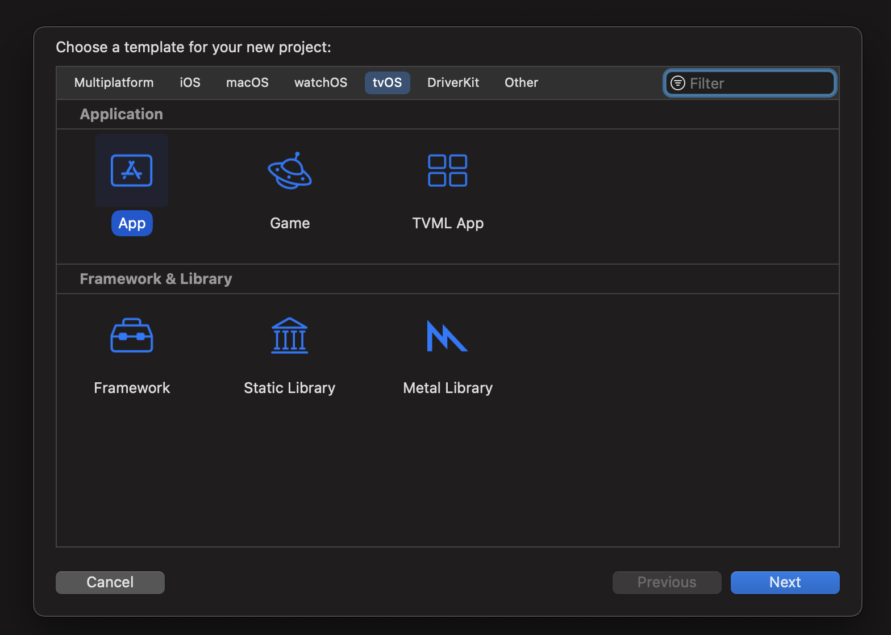
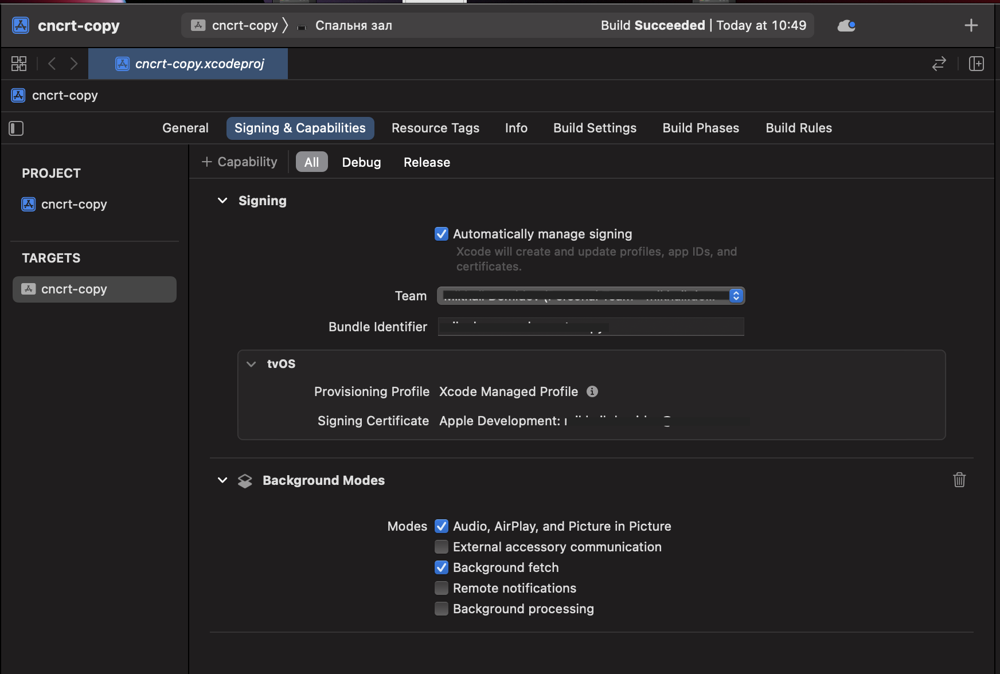

## Kinopub service IPA resinging automation

### Requirements

- MacOS
- ruby 3+
- bundler
- Apple ceriticate installed in `Keychain Access` app

#### TVOS


Your `mobileprovision` seems should contain abilities for background modes as its done in original Kinopub app:

```xml
<key>UIBackgroundModes</key>
<array>
    <string>audio</string>
    <string>fetch</string>
</array>
```

### About

Original IPA file taken from official telegramm chat.

```bash
shasum -a 256 ./tvos/cncrt_tvOS-24-1.12.ipa
```

should produce `c530a2b3ebe0495a061d950a582bb9bf1df60d473661359c21d6bdadc4a029f1` hash.

### Install dependencies (see Gemfile)

```bash
bundle config set --local path 'vendor/bundle'
bundle install
```

### Resign Kinopub TVOS ipa file

- Call from repo root directory. Must use full files paths.

```bash
bundle exec fastlane resign_ipa_tvos provision:/Users/my_user/Downloads/embedded.mobileprovision
```

- If you know what identity needed you can pass it explicitly (or the script will search it through found certificates):

```bash
bundle exec fastlane resign_ipa_tvos provision:/Users/my_user/Downloads/embedded.mobileprovision identity:5EBCD74500DBE201A18629CDCE743303F47D0941
```

#### Result

If success can be found at ./fastlane/resign/cncrt_tvOS-24-1.12.ipa

#### What it will do

1. It takes original Kinopub tvos ipa file (./tvos/cncrt_tvOS-24-1.12.ipa)
2. Unpacks it
3. Takes bundle id from your provided `mobileprovision` file and replaces Kinopub's one
4. Removes from Kinopub's application `Plugins` directory as not required
5. Repacks it back to .ipa
6. Uses `fastlane resign` tool (https://docs.fastlane.tools/actions/resign/) to resign IPA file by provided `mobileprovision`

### Install IPA TVOS

1. Find paired to MacOS your Apple TV in `Apple Configurator` app (https://apps.apple.com/us/app/apple-configurator/id1037126344?mt=12)
2. Drag and Drop there resigned IPA file
3. Done

### Problem to Find/Pair Apple TV to MacOS ?

Here is my gist with full description how to pair Apple TV using Xcode https://gist.github.com/mikehouse/01ffe9ce1a5793406150f7b2fd15abbc

### Why ?

I didn't want to use appdb.io service to make the same thing.

### How to create .mobileprovision using Xcode

1. Open Xcode
2. LogIn in Xcode using your Apple ID (Preferences -> Accounts)
3. Create new project

- File -> New -> Project
- Select there tvos tab
- Select App
- Type your app bundle id
- Select your developer team



4. After project created navigate to Signing & Capabilities section
5. Make sure that correct Developer Team set
6. Background Modes for audio and fetch are enabled (use "+ Capabilities" menu to add these)
7. Device destination is set as your real paired Apple TV that Xcode is able to add its UUID to .mobileprovision file



8. Build project (Product -> Build)
9. Go to the build project directory (Product -> Show Build Folder in Finder)
10. Find there in Products/Debug-appletvos/your-app-name.app/embedded.mobileprovision file

### Kinopub iOS App


```bash
shasum -a 256 ./ios/cncrt.ipa # 846a5d88b86ad52d1075f59f0c0b436b635cee306ce0fcb9377a11f024e52f3f  ios/cncrt.ipa
```

You need Entitlement like this one:

1. Keychanin Sharing
2. App Groups
3. Accosiated Domains
4. Access WiFi Information
5. Background Modes

```xml
<key>UIBackgroundModes</key>
<array>
    <string>audio</string>
    <string>fetch</string>
    <string>remote-notification</string>
</array>
```

```xml
<plist version="1.0">
    <dict>
        <key>aps-environment</key>
        <string>development</string>
        <key>com.apple.security.application-groups</key>
        <array></array>
        <key>com.apple.developer.networking.wifi-info</key>
        <true/>
        <key>keychain-access-groups</key>
        <array>
            <string>8FA39DD6YF.ifsoft.mys</string>
        </array>
        <key>com.apple.developer.associated-domains</key>
        <array>
            <string>applinks:kino.pub</string>
        </array>
    </dict>
</plist>
```

```bash
bundle exec fastlane resign_ipa_ios provision:/Users/my_user/Downloads/embedded.mobileprovision
```