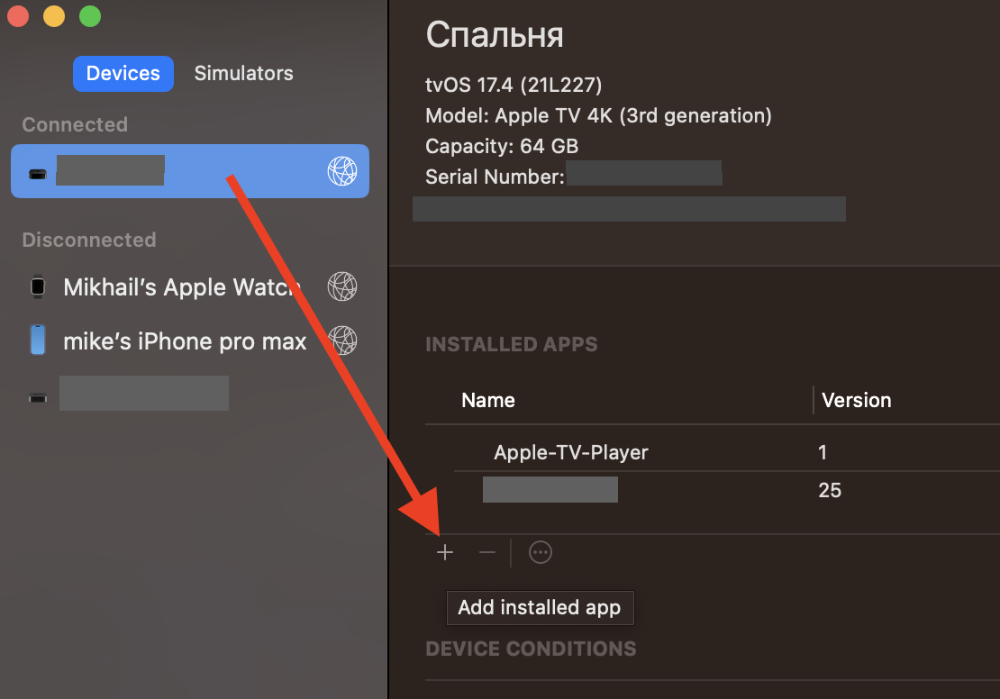
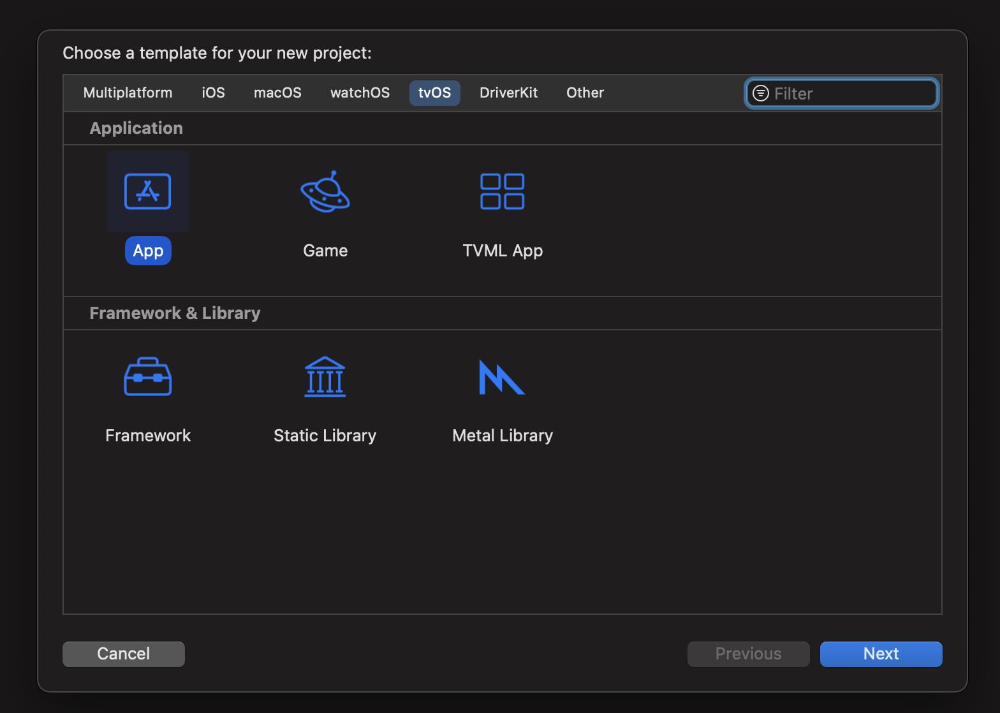
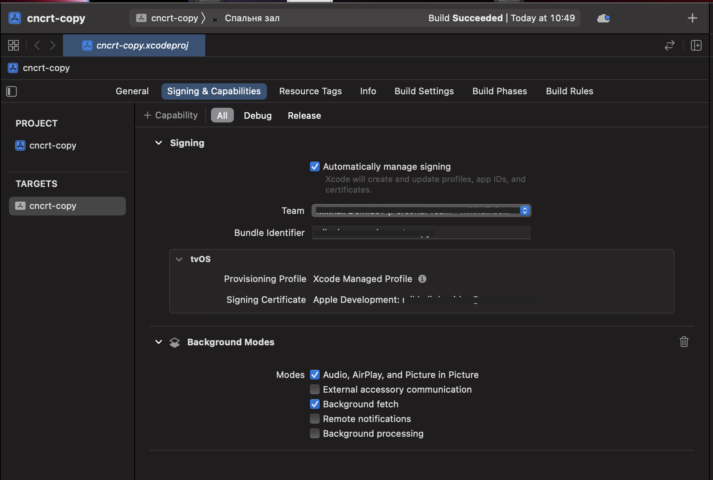
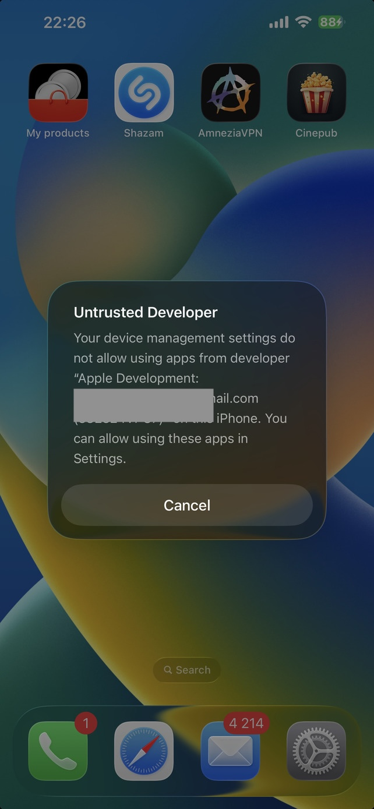

# Kinopub service .ipa resign automation

## Requirements

- MacOS
- ruby 3.2+
- bundler
- Apple Certificate installed in `Keychain Access` app

## Kinopub tvOS


## About

Original tvOS .ipa file taken from official telegram chat.

```bash
shasum -a 256 ./tvos/micro_tvOS-25_11.2023.ipa
```

should produce `0f91b1830684f28125b9bc4b2296fcf48f3d6cd5ffb5746e954822ff0c96e16d` hash.

## Install dependencies (see Gemfile)

```bash
bundle install
```

## Resign KinoPub tvOS .ipa file

- Call from the repo root directory. Must use an absolute file path.

```bash
bundle exec fastlane resign_ipa_tvos provision:/Users/$USER/Downloads/embedded.mobileprovision
```

- If you know what identity needed, you can pass it explicitly (or the script will search it through found certificates):

```bash
bundle exec fastlane resign_ipa_tvos identity:5EBCD74500DBE201A18629CDCE743303F47D0941 provision:/Users/$USER/Downloads/embedded.mobileprovision
```

### Result

On success, the result can be found at ./fastlane/resign/micro_tvOS-25_11.2023.ipa

### What it will do

1. It takes original Kinopub tvos .ipa file (./tvos/micro_tvOS-25_11.2023.ipa)
2. Unpacks it
3. Takes bundle id from your provided `mobileprovision` file and replaces Kinopub's one
4. Removes from Kinopub's application `Plugins` directory as not required
5. Repacks it back to .ipa
6. Uses `fastlane resign` tool (https://docs.fastlane.tools/actions/resign/) to resign .ipa file by provided `mobileprovision`

## Install .ipa tvOS

### Xcode way

- Unpack generated ./fastlane/resign/micro_tvOS-25_11.2023.ipa (change .ipa extension to .zip and unzip it)
- Find there `./fastlane/resign/Payload/Kinopub.app` directory
- Open Xcode → Window → Devices and Simulators
- In the Devices section find your Apple TV
- Click `Add installed app` plus button
- Select there `./fastlane/resign/Payload/Kinopub.app` directory



### ideviceinstaller

Install an app bundle directly to a device using `ideviceinstaller` from `libimobiledevice`

```bash
# find connected Apple TV 
idevice_id # 00008000-001A048C3A712345

# install an app to a device
ideviceinstaller --udid 00008000-001A048C3A712345 --install ~/Downloads/kinopub_app_resign/fastlane/resign/Payload/Kinopub.app
```

## How to create .mobileprovision using Xcode

1. Open Xcode
2. LogIn in Xcode using your Apple ID (Preferences → Accounts)
3. Create a new project

- File → New → Project
- Select there tvOS tab
- Select App



- Type your app bundle id
- Select your developer team

4. Be sure the device destination is set as your real paired Apple TV that Xcode is able to add its UUID to .mobileprovision file as you can use .mobileprovision with unknown device UUID. 



5. Build project (Product → Build)
6. Go to the build project directory (Product → Show Build Folder in Finder)
7. Find there in Products/Debug-appletvos/your-app-name.app/embedded.mobileprovision file

## KinoPub iOS App


```bash
shasum -a 256 ./ios/Cinepub_2.26-27022026.ipa # 79bb1354e1f8039f6a747b1517b9f2828f5979a182d8a73c2a10f7f78ee51605
```

## Resign the iOS App

```bash
bundle exec fastlane resign_ipa_ios provision:/Users/$USER/Downloads/embedded.mobileprovision
```

- With identity

```bash
bundle exec fastlane resign_ipa_ios identity:5EBCD74500DBE201A18629CDCE743303F47D0941 provision:/Users/$USER/Downloads/embedded.mobileprovision
```

### Result

On success, the result can be found at ./fastlane/resign/Cinepub_2.26-27022026.zip

### What it will do

1. It takes the original Kinopub iOS.ipa file (./ios/Cinepub_2.26-27022026.ipa)
2. Unpacks it
3. Takes bundle id from your provided `mobileprovision` file and replaces Kinopub's one
4. Removes from Kinopub's application `Plugins` directory as not required
5. Repacks it back to .ipa
6. Uses `fastlane resign` tool (https://docs.fastlane.tools/actions/resign/) to resign .ipa file by provided `mobileprovision`

## Install .ipa iOS

### Xcode way

- Unpack generated ./fastlane/resign/Cinepub_2.26-27022026.ipa (change .ipa extension to .zip and unzip it)
- Find there `./fastlane/resign/Payload/Cinepub.app` directory
- Open Xcode → Window → Devices and Simulators
- In the Devices section find your Apple TV
- Click `Add installed app` plus button
- Select there `./fastlane/resign/Payload/Cinepub.app` directory


### ideviceinstaller

Install an app bundle directly to a device using `ideviceinstaller` from `libimobiledevice`

```bash
# find connected iPhone 
idevice_id # 00008000-001A048C3A712345

# install an app to a device
ideviceinstaller --udid 00008000-001A048C3A712345 --install ~/Downloads/kinopub_app_resign/fastlane/resign/Payload/Cinepub.app
```

### Untrusted Developer Warning



To fix this, go to Settings → General → VPN & Device Management → Developer App and click on the 'Trust $ {email}' button.

## How to create .mobileprovision using Xcode

The same way as for Kinopub tvOS, except use iOS Xcode App template and select there your real iOS device

----

‼️ **Important:**

Be aware that installation via uploading .ipa file using AirDrop and Apple Configurator to the Apple device does not work anymore for the latest iOS and tvOS versions. Use the .app directory instead.