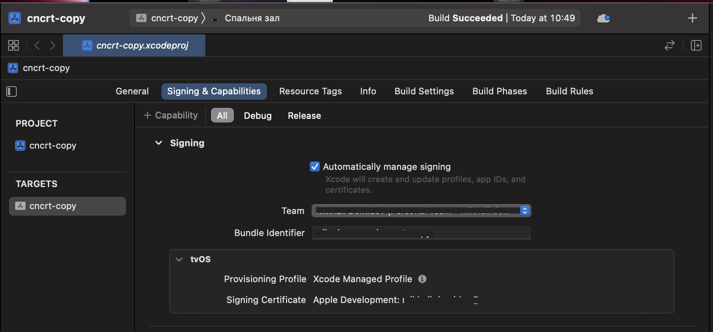

## Kinopub service IPA resinging automation

### Requirements

- MacOS
- ruby 3+
- bundler
- Apple Certificate installed in `Keychain Access` app

## Kinopub TVOS


### About

Original IPA file taken from official telegram chat.

```bash
shasum -a 256 ./tvos/micro_tvOS-25_11.2023.ipa
```

should produce `0f91b1830684f28125b9bc4b2296fcf48f3d6cd5ffb5746e954822ff0c96e16d` hash.

### Install dependencies (see Gemfile)

```bash
bundle config set --local path 'vendor/bundle'
bundle install
```

### Resign Kinopub TVOS ipa file

- Call from repo root directory. Must use full files paths.

```bash
bundle exec fastlane resign_ipa_tvos provision:/Users/my_user/Downloads/embedded.mobileprovision
```

- If you know what identity needed you can pass it explicitly (or the script will search it through found certificates):

```bash
bundle exec fastlane resign_ipa_tvos provision:/Users/my_user/Downloads/embedded.mobileprovision identity:5EBCD74500DBE201A18629CDCE743303F47D0941
```

#### Result

If success can be found at ./fastlane/resign/micro_tvOS-25_11.2023.ipa

#### What it will do

1. It takes original Kinopub tvos ipa file (./tvos/micro_tvOS-25_11.2023.ipa)
2. Unpacks it
3. Takes bundle id from your provided `mobileprovision` file and replaces Kinopub's one
4. Removes from Kinopub's application `Plugins` directory as not required
5. Repacks it back to .ipa
6. Uses `fastlane resign` tool (https://docs.fastlane.tools/actions/resign/) to resign IPA file by provided `mobileprovision`

### Install IPA TVOS

1. Find paired to MacOS your Apple TV in `Apple Configurator` app (https://apps.apple.com/us/app/apple-configurator/id1037126344?mt=12)
2. Drag and Drop there resigned IPA file
3. Done

### Problem to Find/Pair Apple TV to MacOS ?

Here is my gist with full description how to pair Apple TV using Xcode https://gist.github.com/mikehouse/01ffe9ce1a5793406150f7b2fd15abbc

### Why ?

I didn't want to use appdb.io service to make the same thing.

### How to create .mobileprovision using Xcode

1. Open Xcode
2. LogIn in Xcode using your Apple ID (Preferences -> Accounts)
3. Create new project

- File -> New -> Project
- Select there tvos tab
- Select App


- Type your app bundle id
- Select your developer team

4. Device destination is set as your real paired Apple TV that Xcode is able to add its UUID to .mobileprovision file



5. Build project (Product -> Build)
6. Go to the build project directory (Product -> Show Build Folder in Finder)
7. Find there in Products/Debug-appletvos/your-app-name.app/embedded.mobileprovision file

## Kinopub iOS App


```bash
shasum -a 256 ./ios/cncrt.ipa # 846a5d88b86ad52d1075f59f0c0b436b635cee306ce0fcb9377a11f024e52f3f  ios/cncrt.ipa
```

### Resign the ios App

```bash
bundle exec fastlane resign_ipa_ios provision:/Users/my_user/Downloads/embedded.mobileprovision
```

There are two types of accounts for signing:

1. Developer account (paid 100$ per year, a sign is valid for a year)
2. Free account (a sign is valid for 7 days)

Also there are two types of app delivering to a device:

1. *.ipa (zip archive for *.app) file (using App Configuration/Firebase/TestFlight)
2. install *.app directly to a device from Terminal

For free account the only direct install of *.app available. Apple did it this way because you are allowed to install an app with free account only during development from Xcode. That is, if you have only free account, then after signing there is only one way to install an app, the flow is following:

1. Re-sign original ipa (ios/cncrt.ipa) using the project's script
2. Unpack re-signed ipa to get an app bundle
3. Install an app bundle directly to a device using set of libs from `libimobiledevice`

```bash
# find connected iPhone 
idevice_id # 00008000-001A048C3A712345

# install an app to a device
ideviceinstaller --udid 00008000-001A048C3A712345 --install ~/Downloads/kinopub_app_resign/fastlane/resign/Payload/cncrt.app
```

For a paid developer account just install the app using script created ipa file, delivering ipa to a device using App Configurator or AirDrop.
